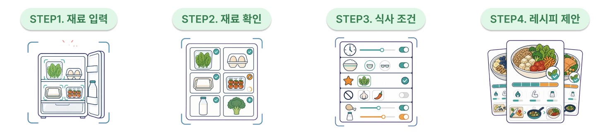

<p align="center">
  
</p>

# 쉿, 나만 저속노화!

**냉장고 사진 한 장으로 시작하는 개인 맞춤형 한식 추천 서비스**

냉장고에 무엇이 있는지 일일이 적지 않아도 됩니다. 사진을 올리면 AI가 식재료를 찾고,
사용자가 결과를 확인한 뒤 식품의약품안전처 식품안전나라 레시피 중 오늘의 식사 조건에
잘 맞는 메뉴 3개를 추천합니다.

Streamlit으로 만든 웹 서비스이므로 배포된 URL에 접속하면 별도 설치 없이 브라우저에서
바로 사용할 수 있습니다.

## 무엇을 해결하나요?

- 냉장고에 있는 재료로 무엇을 만들지 떠올리기 어려운 순간
- 먼저 사용해야 할 재료를 놓쳐 버리는 문제
- 건강을 고려하면서도 장보기와 조리 부담은 줄이고 싶은 상황
- 레시피를 고를 때 영양정보와 추천 이유를 함께 보고 싶은 경우

## 이렇게 사용해요

<p align="center">
  
</p>

1. **냉장고 사진 올리기**
   냉장고 안이 잘 보이는 사진을 한 장 업로드합니다.

2. **재료 확인하기**
   AI가 찾은 재료를 확인하고 잘못된 항목은 수정하거나 삭제합니다. 원하는 재료를
   새 행으로 직접 추가하고, 빨리 사용해야 할 재료는 `우선 소진`으로 표시할 수 있습니다.

3. **오늘의 조건 선택하기**
   요리 종류, 조리 시간, 단백질·나트륨 선호, 제외·알레르기 재료를 선택합니다.

4. **추천 메뉴 확인하기**
   맞춤 추천 점수, 추천 이유, 영양정보, 필요한 추가 재료와 조리법을 확인합니다.

## 주요 기능

### 냉장고 재료 인식

- `Qwen/Qwen3.5-9B` VLM으로 사진 속 식재료 인식
- 한글·영문 후보 중 신뢰도가 더 높은 결과 선택
- 영문 재료가 동의어 사전에 있으면 한글 대표명으로 표시
- 인식 결과를 사용자가 직접 추가·수정·삭제·정렬

### 식품안전나라 레시피 추천

- 식품안전나라 `COOKRCP01` API에서 레시피를 실시간으로 불러옴
- 레시피를 별도 JSON 파일이나 데이터베이스에 미리 저장하지 않음
- 제외·알레르기 재료는 추천 점수를 계산하기 전에 후보에서 제거
- 최종 추천 메뉴 3개와 최대 20단계 조리법 제공

### 이해하기 쉬운 맞춤 추천 점수

추천 점수는 다음 다섯 가지 기준을 100점 기준으로 합산합니다.

| 평가 기준 | 비중 | 의미 |
|---|---:|---|
| 냉장고 재료 활용 | 35% | 현재 보유한 재료를 얼마나 활용하는지 |
| 장보기 부담 절감 | 15% | 추가로 준비할 재료가 얼마나 적은지 |
| 우선 소진 재료 | 15% | 먼저 사용하고 싶은 재료가 포함되는지 |
| 저속노화 식사 | 25% | 단백질·나트륨과 통곡물·콩류·채소 구성을 고려한 점수 |
| 조리 편의 | 10% | 조리 단계와 예상 시간을 고려한 편의성 |

결과 화면의 도넛 차트는 최종 획득 점수를 100%로 환산해 각 기준이 최종 점수에
얼마나 기여했는지 보여 줍니다.

## 사용하는 데이터와 AI

| 구분 | 사용 항목 | 역할 |
|---|---|---|
| 식품의약품안전처 식품안전나라 | `COOKRCP01` | 메뉴명, 재료, 영양정보, 조리법과 이미지 제공 |
| Hugging Face Inference Providers | `Qwen/Qwen3.5-9B` | 냉장고 사진에서 보이는 식재료 추출 |
| 프로젝트 추천 로직 | 설명 가능한 가중치 방식 | 사용자 조건에 맞는 레시피 필터링과 정렬 |

## 알아두세요

- 사진에서 가려진 식품, 정확한 수량과 유통기한은 신뢰성 있게 판단할 수 없습니다.
- 식품안전나라 API가 제공하지 않는 식이섬유, 첨가당, 포화지방 값은 임의로 만들지 않습니다.
- 알레르기 정보는 원본 API의 공식 알레르기 라벨이 아니므로 사용자가 최종 재료를 반드시 확인해야 합니다.
- 맞춤 추천 점수는 프로젝트의 설명 가능한 추천 기준이며 의료적 진단이나 노화 속도 측정값이 아닙니다.
- 업로드 이미지는 재료 인식을 위해 Hugging Face Inference Provider로 전송되며,
  이 프로젝트 코드에서는 이미지 파일을 별도로 저장하지 않습니다.

---

<details>
<summary><strong>개발 및 로컬 실행 안내</strong></summary>

### 실행 환경

- Python 3.11 이상
- 식품안전나라 Open API 인증키
- Hugging Face 토큰과 Inference Providers 사용 가능 크레딧

### 설치

```bash
python3 -m venv .venv
source .venv/bin/activate
pip install -r requirements.txt
```

Windows PowerShell에서는 다음 명령으로 가상환경을 활성화합니다.

```powershell
.venv\Scripts\Activate.ps1
```

### 인증키 설정

```bash
cp .streamlit/secrets.toml.example .streamlit/secrets.toml
```

생성한 `.streamlit/secrets.toml`에 실제 인증키를 입력합니다.

```toml
FOODSAFETY_API_KEY = "발급받은_식품안전나라_인증키"
HF_TOKEN = "hf_xxxxxxxxxxxxxxxxxxxxxxxxxxxxxxxx"

VLM_MODEL = "Qwen/Qwen3.5-9B"
VLM_PROVIDER = "auto"
FOODSAFETY_API_BASE_URL = "https://openapi.foodsafetykorea.go.kr/api"
```

실제 `secrets.toml`은 `.gitignore`에 포함되어 있으므로 Git에 올리지 않습니다.

### 실행

```bash
streamlit run app.py
```

브라우저에서 `http://localhost:8501`로 접속합니다. `HF_TOKEN`이 없어 사진 분석을
사용할 수 없는 경우에도 Step 2 표에 재료를 직접 추가해 추천 흐름을 시험할 수 있습니다.

### 테스트

```bash
pip install -r requirements-dev.txt
pytest -q
```

- `requirements.txt`: 웹앱 실행과 배포에 필요한 패키지
- `requirements-dev.txt`: 위 실행 패키지와 테스트용 `pytest`
- `tests/`: API 파싱, 재료 정규화, 추천 점수, VLM 응답과 Streamlit 화면 회귀 테스트

### 프로젝트 구조

```text
.
├── app.py                     # Streamlit 화면과 사용자 흐름
├── assets/                    # README 이미지
├── docs/presentation/         # 발표 자료 보관
├── .streamlit/                # 테마와 인증키 예시
├── src/
│   ├── foodsafety_client.py   # 식품안전나라 API 연동
│   ├── ingredients.py         # 한영 재료 동의어와 정규화
│   ├── models.py              # 레시피 데이터 모델
│   ├── ranking.py             # 추천 필터와 점수 계산
│   ├── time_estimator.py      # 조리 시간 표현 추출
│   └── vlm_client.py          # 이미지 인식과 VLM 응답 처리
├── tests/                     # 자동 테스트
├── requirements.txt           # 배포용 의존성
└── requirements-dev.txt       # 개발·테스트용 의존성
```

### 웹 배포와 iframe

Streamlit Community Cloud에서는 GitHub 저장소의 `main` 브랜치와 `app.py`를 선택하고,
배포 설정의 Secrets에 로컬 `secrets.toml` 값을 등록합니다. 공개 앱을 iframe으로
표시할 때는 다음 형식의 URL을 사용할 수 있습니다.

```text
https://프로젝트주소.streamlit.app/?embed=true
```

</details>

## 출처

레시피, 영양정보, 조리법과 이미지는 식품의약품안전처 식품안전나라
[`COOKRCP01`](https://www.foodsafetykorea.go.kr/api/openApiInfo.do?menu_grp=MENU_GRP31&menu_no=661&svc_no=COOKRCP01)
데이터를 사용합니다.
